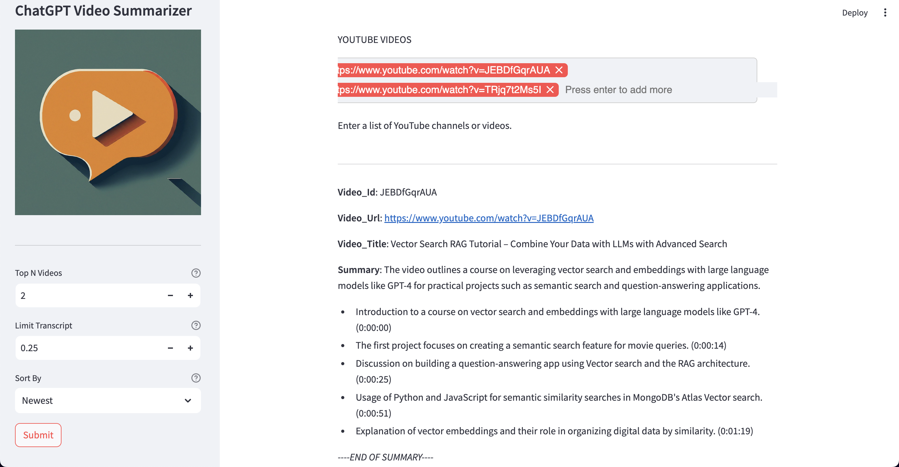

# Video Summarizer
## About
This tool uses ChatGPT to summarise a YouTube video by providing either a YouTube channel or the video link.

It will provide a brief 150 word summary of the video as well as the top 5 main points in the video.
The main points are timestamped so that it's easy to navigate the video where
the conversation is taking place. 

This tool allows one to determine whether to summarise the entire video or
a portion of the video - the first 25% of the video being the default.

## Installation
- Clone this repo
- Set up Mongodb:
  - Create `admin` user with `readWrite` access
  - Create two databases
- Set up Python in a vitual environment and install the Poetry Python package
- Install packages: `poetry install`
## Creating a Mongodb user
```
use summaries
db.createUser(
  {
    user: "admin",
    pwd: passwordPrompt(),  // or cleartext password
    roles: [
       { role: "readWrite", db: "transcripts" },
       { role: "readWrite", db: "summaries" }
    ]
  }
)
```
## Usage
### Build the Docker container
**Option 1**
- Clone this repo
- Build the Docker container: `DOCKER_BUILDKIT=1 docker build -f Dockerfile -t video_summarizer .`
**Option 2**
- Run: `docker pull --platform=linux/arm64 johnmw01/video_summarizer:latest`

### Run the container
- Create a `.env` with your credentials
- Run the Docker container: `docker run --env-file .env -p 8501:8501 -p 12000:12000 video_summarizer`
- Access the app: `http://0.0.0.0:8501/`
- Enter a channel url or video url to the api
- Video summaries will be saved in the database and display on the app

## Web App

